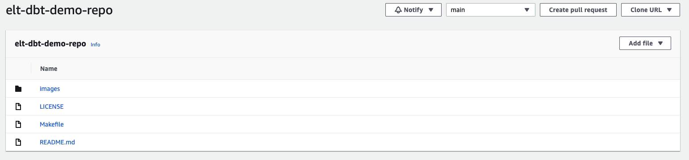
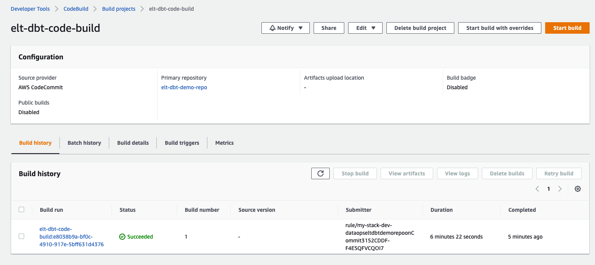
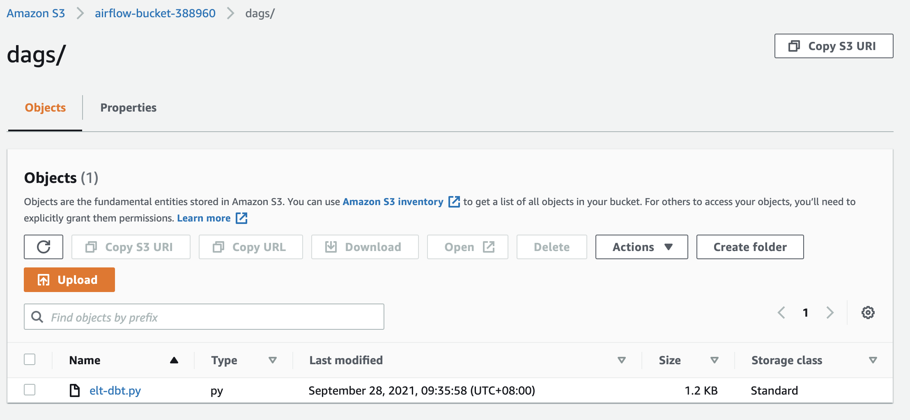
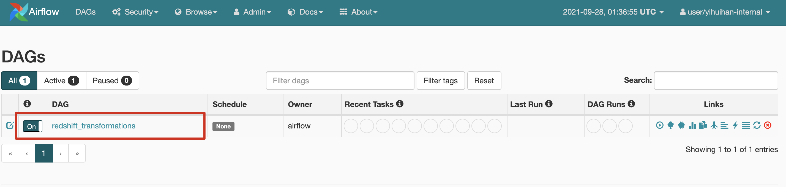
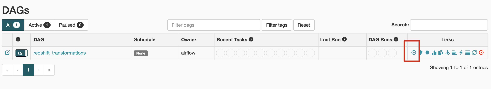
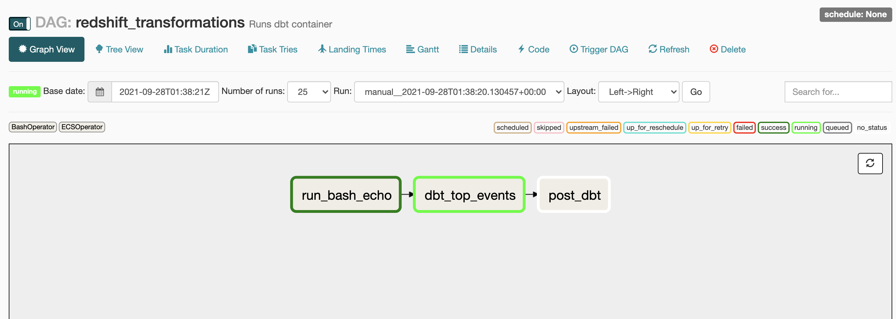
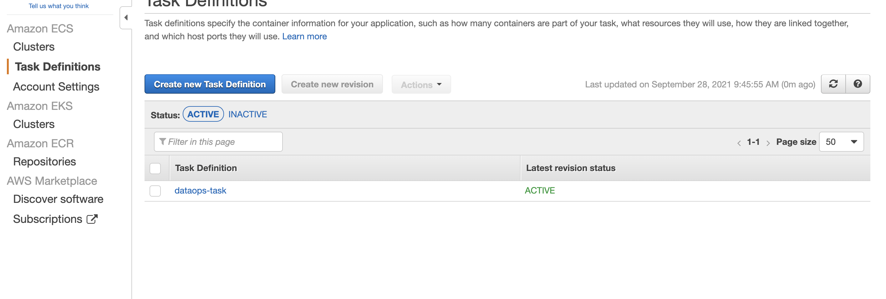
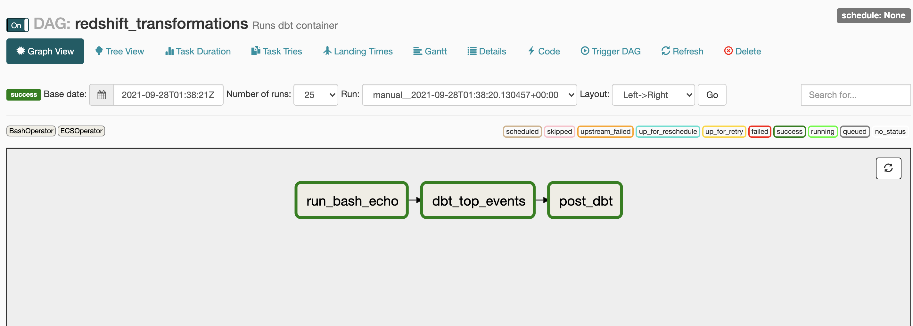
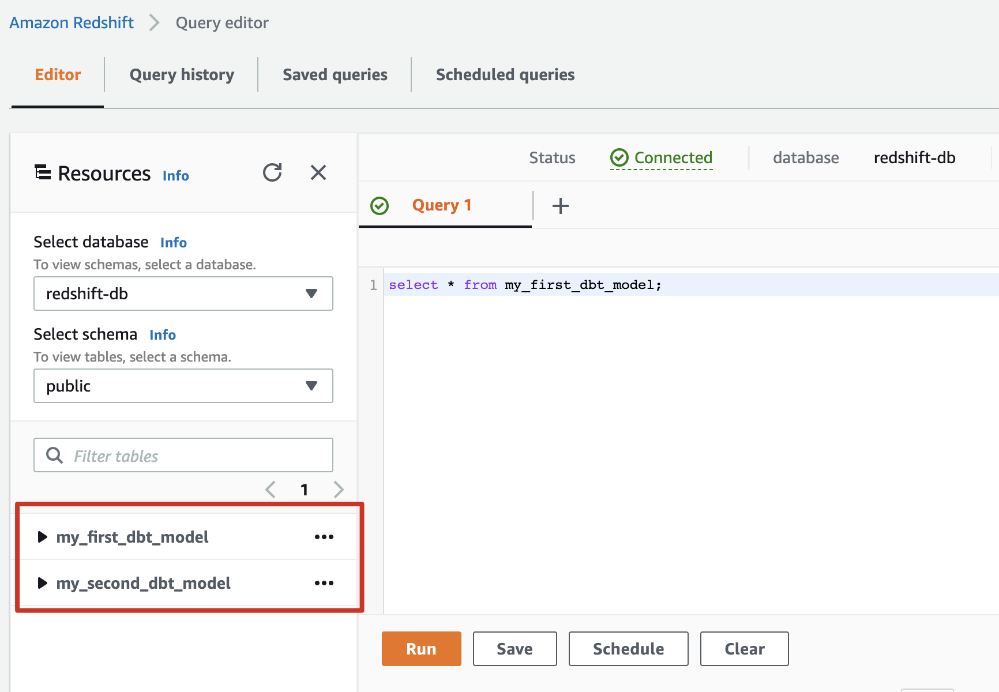

Blog "使用AWS CDK，在云上构建DataOPS 平台" 有两个代码仓库。

本仓库是 Data Analysts 代码的参考实现，
Data Infra Engineer 代码参考实现请参看 [这里](https://github.com/readybuilderone/elt-dbt-redshift-demo-for-data-engineer)

### 架构图及流程说明


#### Data Infra Engineer

通过CDK 创建DataOPS 平台, 主要组件包括:

- Redshift 集群
- CodeCommit， CodeBuild，用于构建 Data Analysts 开发的DBT工程的持续集成流程
- ECR，用于存放管理Data Analysts 开发的DBT工程的Docker Image
- MWAA，用于供数据开发人员调度DBT任务的Airflow集群
- ECS Cluster, 用于运行DBT Task

#### Data Analysts

在Data Infra Engineer使用CDK创建好DataOPS平台之后，Data Analysts大致操作流程如下:

1. Data Analysts使用SQL基于DBT框架编写代码，推送到GitCommit；

   GitCommit 会自动触发CodeBuild，下载代码，进行编译，生成container 镜像，并推送到ECR仓库；

2. Data Analysts，编写Airflow的DAG，并上传到S3；

3. Data Analysts，在Airflow中管理触发DAG；

   Airflow 会自动在ECS Cluster中创建Task，运行DBT任务。

## 在Data Infra Engineer 构建好DataOPS平台之后，Data Analysts使用方法如下:

##### 推送代码到CodeCommit

Data Analysts 推送代码到CodeCommit之后，应该自动触发CodeBuild生成container image，推送到ECR。

Data Analysts使用的Sample代码托管在 [Github](https://github.com/readybuilderone/elt-dbt-redshift-demo-for-data-analysts)，在配置好CodeCommit权限(如何配置可参考 [官方文档](https://docs.aws.amazon.com/codecommit/latest/userguide/setting-up-ssh-unixes.html))之后，可以采用如下命令推送到CodeCommit:

``` shell
git clone https://github.com/readybuilderone/elt-dbt-redshift-demo-for-data-analysts.git
cd elt-dbt-redshift-demo-for-data-analysts
git remote -v
git remote add codecommit <YOUR-CODECOMMIT-SSH-ADDRESS>
git push codecommit
```

##### 观察DataOPS过程

在push 之后，进入CodeCommit查看代码更新, 可以看到代码已经成功推送到CodeCommit:




进入CodeBuild查看，会发现已经自动构建container image，并推送到了ECR:




进入到ECR中查看，会发现刚刚构建的container image:


##### Data Analysts 构建Airflow DAG，触发DBT任务，使用Fargate运行DBT 任务

示例Airflow 的DAG如下：

#### `elt-dbt.py`

``` python
import os
from airflow import DAG
from airflow.contrib.operators.ecs_operator import ECSOperator
from airflow.operators.bash_operator import BashOperator
from airflow.utils.dates import days_ago
from datetime import timedelta

default_args = {
    "owner": "airflow",
    "depends_on_past": False,
    "start_date": days_ago(2),
    "retries": 0,
    "retry_delay": timedelta(minutes=5),
}

dag = DAG(
    "redshift_transformations",
    default_args=default_args,
    description="Runs dbt container",
    schedule_interval=None,
    is_paused_upon_creation=False,
)

bash_task = BashOperator(task_id="run_bash_echo", bash_command="echo 1", dag=dag)
post_task = BashOperator(task_id="post_dbt", bash_command="echo 0", dag=dag)

dbt_top_events = ECSOperator(
    task_id="dbt_top_events",
    dag=dag,
    aws_conn_id="aws_ecs",
    cluster="dataops-ecs-cluster",
    task_definition="dataops-task",
    launch_type="FARGATE",
    overrides={

    },
    network_configuration={
        "awsvpcConfiguration": {
            "subnets": ["<YOUR-SUBNET-ID>", "<YOUR-SUBNET-ID>"],
        },
    },
    awslogs_stream_prefix="ecs/dbt-cdk-container",
)

bash_task >> dbt_top_events >> post_task

```

注意: 读者需要替换<YOUR-SUBNET-ID> 为自己环境的值（Data Infra Engineer 使用CDK 创建DataOPS平台时的返回值）


替换好之后，将elt-dbt.py 上传到Airflow的Bucket中(Bucket Name见 Data Infra Engineer 使用CDK 创建DataOPS平台时的返回值)。

``` shell
aws s3 cp ./elt-dbt.py S3://<YOUR-BUCKET>/dags/ --profile <YOUR-PROFILE>
```




进入Airflow，稍等片刻，可以看到对应的DAG。




在Airflow中触发DAG




可以看到DAG已经被执行：



在运行 dbt_top_events 的阶段，进入ECS，可以看到dataops-task在运行：



在DAG执行完成之后，进入RedShift查看验证结果：




可以看到，my_fist_dbt_model 和 my_second_dbt_model 已经生成，DBT任务执行成功。



